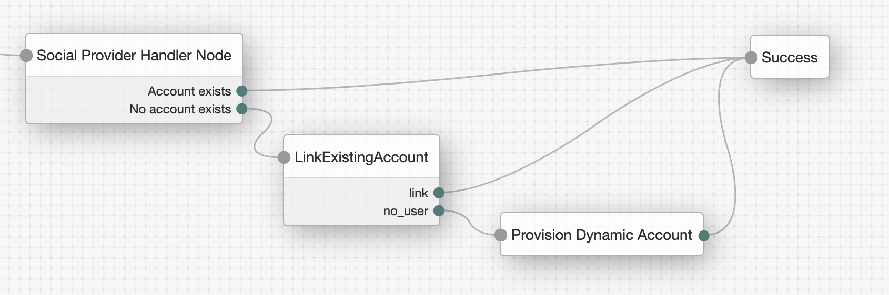

# Social Provider Handler and link existing accounts

## Introduction

This repo consists of a few scripts related to Social Provider Handler node regarding linking existing acconts and allow federation with multiple IDPs.
Social Provider Handler node limitations:
- Can't link an existing account. It's been designed for JIT provisioned accounts.
- Can't federate with multiple IDPs as AM can't link accunts, just create them.

There are 3 JS nodes:

1) am-transformation-script.groovy
2) am-normalization-script.groovy 
3) link-existing-account.js. Search for the user in the user store based on ID token claim and create the link

## Contents

Example AM tree:

## Configuration
Create a journey using the tree above as a reference and the and scripted nodes from src directory.